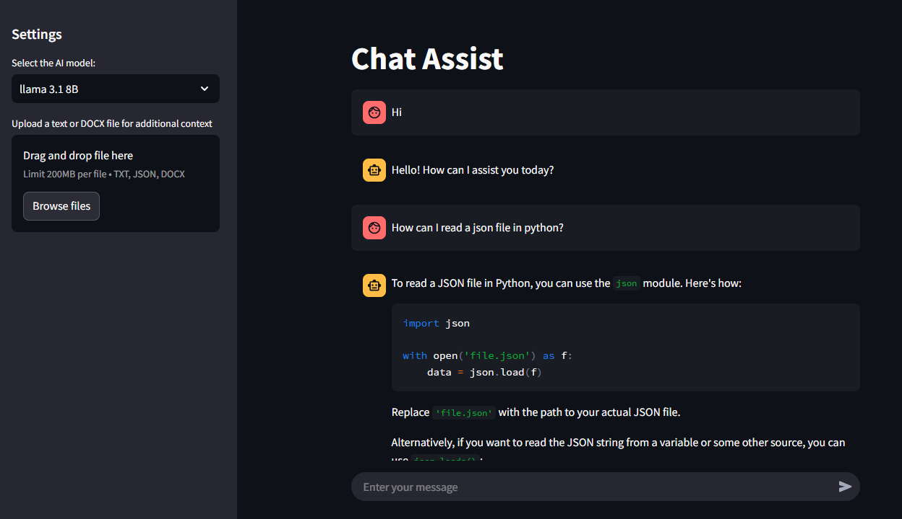

# Chat Assist

Chat Assist is an AI-powered chatbot built using `streamlit` and `ollama`, with a contextual search system leveraging `FAISS` and `sentence-transformers` for relevant response retrieval.



## Features

- **Multiple AI Model Support**: Supports models such as DeepSeek-R1 (1.5B, 8B, 14B), LLaMA 3.1 (8B), LLaMA 3.2 (3B), and Mistral 7B.
- **Context-Aware Responses**: Uses vectorized context matching to enhance response accuracy.
- **Chat History Retention**: Maintains conversation history to provide coherent interactions.
- **Embedded Context Search**: Uses FAISS to retrieve relevant stored context dynamically.
- **File-Based Context Expansion**: Allows users to upload text, JSON, or DOCX files for additional context.

## Installation

### Prerequisites

- Python 3.8+
- Install required dependencies:
  ```sh
  pip install -r requirements.txt
  ```

### Install Ollama
Ollama is required to run AI models locally. Follow the steps below to install it:

- **macOS**: Download the installer from the [Ollama website](https://ollama.com/download) and follow the instructions.
- **Linux**: Open a terminal and run:
  ```sh
  curl -fsSL https://ollama.com/install.sh | sh
  ```
  Refer to the [Ollama Linux guide](https://github.com/ollama/ollama/blob/main/docs/linux.md) for more details.
- **Windows**: Download and install Ollama from the [official website](https://ollama.com/download).

### Install AI Models
After installing Ollama, download and run the required AI models:

```sh
ollama run llama3.1
```

This command will automatically download and install the LLaMA 3.1 model. For more models, visit the [Ollama model library](https://ollama.com/library).

## Usage

1. Start the chatbot:

   To guarantee that your app is only accessible from your machine, run Streamlit with the `--server.address` option set to localhost:
   ```sh
   streamlit run chat_assist.py --server.address localhost
   ```

2. Select the AI model from the dropdown menu.
3. Upload an optional file (TXT, DOCX) to provide additional context.
4. Enter your message in the chat input.
5. The bot retrieves relevant context and generates a response using an embedded context search system.

## How It Works

Chat Assist leverages FAISS-based vectorization to dynamically retrieve relevant context from a predefined dataset or uploaded files. The chatbot interface is built with `streamlit`, while the AI model is hosted via `ollama`.

## Example Query

```
User: "Tell me about autonomous vehicles in heavy rain."
Bot: "Autonomous vehicles face challenges in heavy rain due to sensor interference and reduced visibility. Relevant studies suggest..."
```

## Future Improvements

- Enhance model selection.
- Improve context matching and retrieval.
- Support for additional AI models.
- Optimize performance for large document uploads.

## License

This project is licensed under the MIT License.
